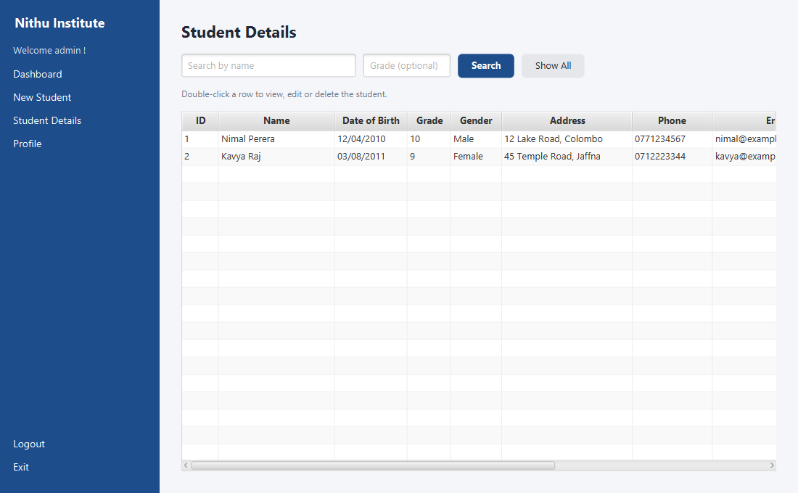
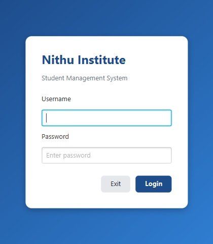
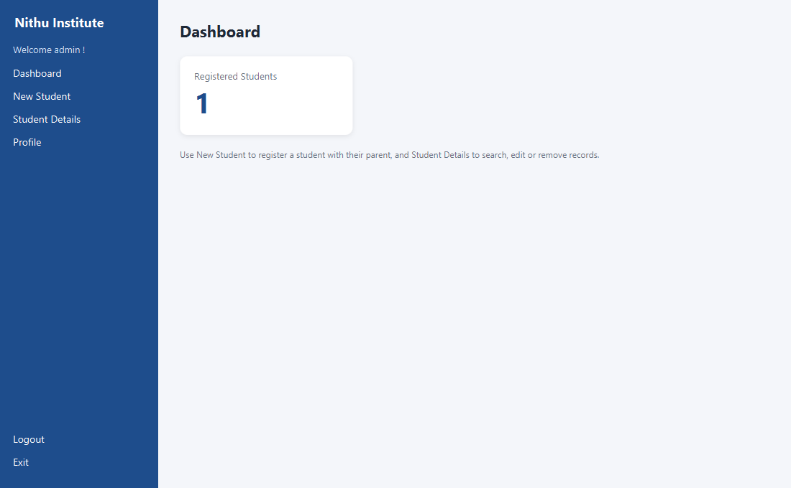
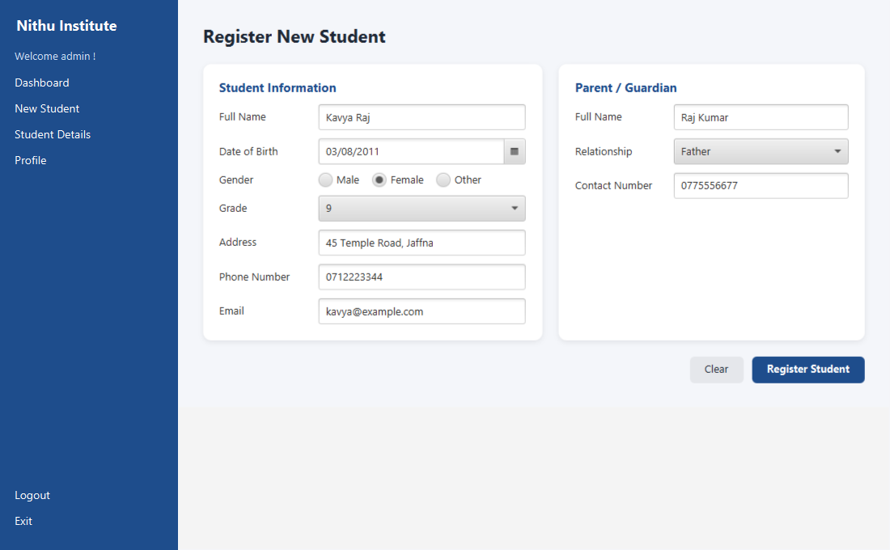
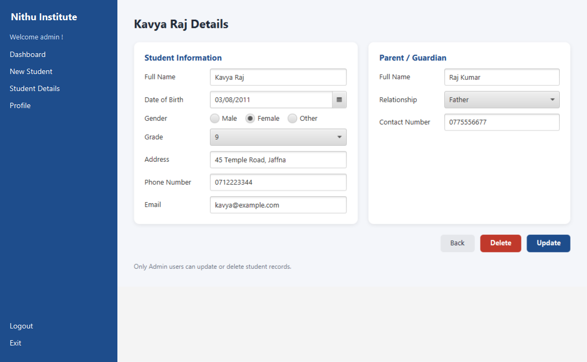
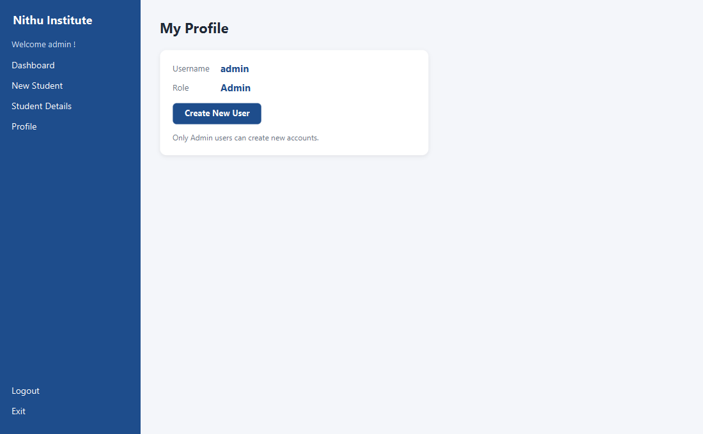
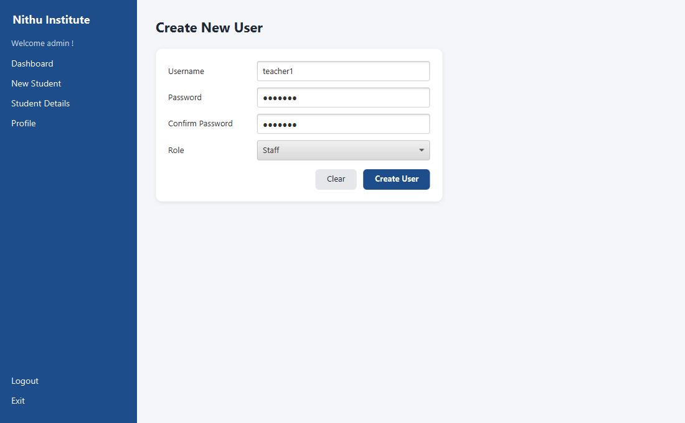

# Nithu Institute – Student Management System

A JavaFX desktop application for managing students at Nithu Institute. Staff can register students together with their parent or guardian, search and browse records, and update or remove them. Access is role-based (Admin / Staff), and the data is stored in MySQL.



## Features

- **Login with roles**: Admin and Staff accounts. Passwords are stored as salted PBKDF2 hashes.
- **Dashboard**: shows the number of registered students.
- **Register student**: student details and parent/guardian details are saved together in one transaction.
- **Student details**: a table of all students and their parents, with search by name (partial match) and an optional grade filter.
- **Edit / delete**: double-click a row to open it. Only Admin users can update or delete. Deleting a student also removes their parent record.
- **Profile & user management**: view your account. Admin users can create new Admin or Staff accounts.
- **Notifications**: ControlsFX toast notifications for success and error messages.

## Screenshots

| Login | Dashboard |
|---|---|
|  |  |

| Register student | Edit student |
|---|---|
|  |  |

| Profile | Create user |
|---|---|
|  |  |

## Tech stack

- Java 17+ with JavaFX 21 (FXML + CSS)
- MySQL 8 via JDBC (`mysql-connector-j`)
- ControlsFX for notifications
- Maven (wrapper included, so Maven does not need to be installed)
- JUnit 5

## Project structure

```
src/main/java/com/example/nithuinstitueapp/
├── Launcher.java / NithuApplication.java   # entry point
├── common/        # DBController (JDBC), NotificationController, PasswordUtil, Common (view loading)
├── controller/    # one controller per FXML screen
├── model/         # Student
└── service/       # StudentService
src/main/resources/com/example/nithuinstitueapp/
├── view/          # FXML screens
└── css/style.css
database/schema.sql  # tables, seed users and sample data
```

## Getting started

### 1. Create the database

```bash
mysql -u root -p < database/schema.sql
```

This creates `nithuinstitutedb` with the `user`, `student` and `parent` tables, two default accounts and one sample student.

| Username | Password | Role |
|---|---|---|
| `admin` | `admin123` | Admin |
| `staff` | `staff123` | Staff |

Change these passwords before using the app with real data.

### 2. Configure the connection (optional)

By default the app connects to `jdbc:mysql://localhost:3306/nithuinstitutedb` as `root` with an empty password. To change this, use either of these:

- create a `db.properties` file in the folder you run the app from:
  ```properties
  db.url=jdbc:mysql://localhost:3306/nithuinstitutedb
  db.user=nithu_app
  db.password=your-password
  ```
- or set the environment variables `NITHU_DB_URL`, `NITHU_DB_USER` and `NITHU_DB_PASSWORD`.

### 3. Run

```bash
./mvnw javafx:run
```

On Windows, use `mvnw.cmd javafx:run`. To run the tests, use `./mvnw test`.

## Roadmap

Planned modules that are not built yet: subject enrolment, attendance, classes, exams, payments and teacher management.
